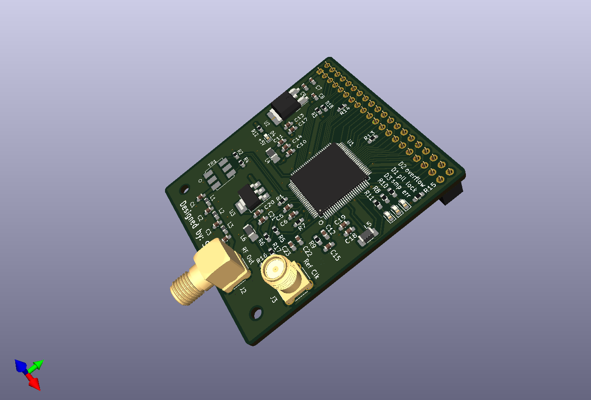
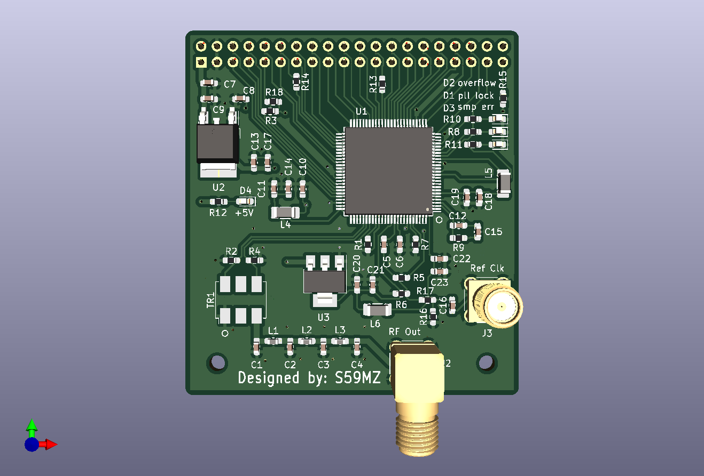
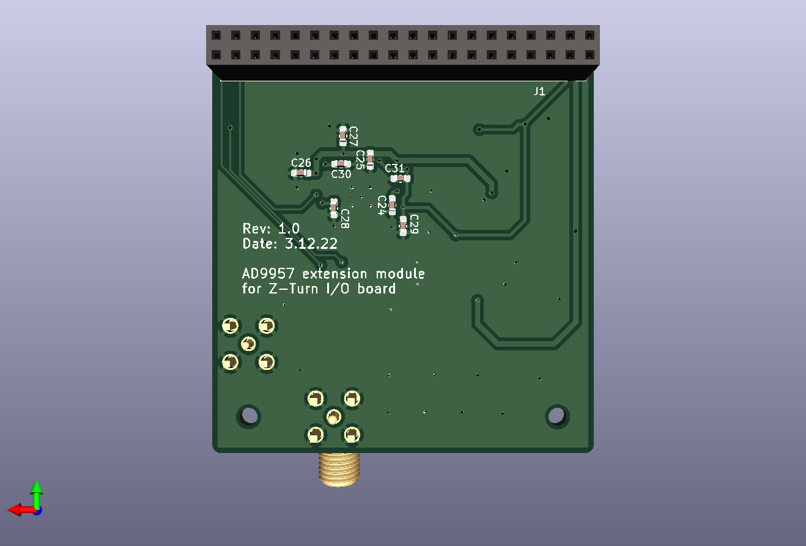

# iqdac
AD9957 DAC test module for the Z-Turn I/O expansion card

Schematic:
[iqdac.pdf](iqdac.pdf)

BOM:
[iqdac.csv](iqdac.csv)

Gerbers:
[gerbers.zip](https://github.com/s59mz/kicad-iqdac/raw/main/gerbers.zip)
